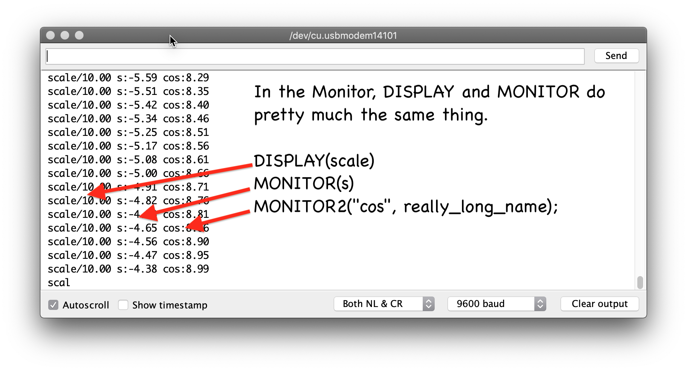

Description
===========

The macros defined in this package make it easy to properly format
data for display by the Arduino Serial Plotter program.  It's also not a bad
way to display data in the Serial Monitor for many applications.

The Arduino Plotter accepts named values in the following format

    foo:43 bar:65 baz:21

The key and value are separated by a ':', and multiple key/value pairs
are separated by white space.  If you separate the key and value
with '/', it conveniently displays the key and value on the top line
with the other keys.

Usage
=====

- **MONITOR(v)** will output the variable v, keyed by the variable name.
- **MONITOR2(k, v)** allows the key to be specified.  It's useful if v isn't
  a variable name.
- **MONITOR\_ENDL()** will end monitor output.
- **MONITOR\_RESET()** will clear and reinitialize the plotter display.
- **DISPLAY(v)** and **DISPLAY2(k, v)** are similar to MONITOR and MONITOR2,
  except they use '/' as a separator, giving a non-plotted display of
  the key and value.

Defining the macro **NO\_MONITOR\_OUTPUT** removes all monitoring data from
the compiled code.

Examples
========

    #include "ArrbotMonitor.h"
    #include <math.h>

    void setup() {
      Serial.begin(9600);
    }

    // Uncomment the following line to disable monitor output
    // #define NO_MONITOR_OUTPUT

    float scale = 10.0;
    float x = 0.0;
    void loop() {
      x += .01;
      float s = sin(x) * scale;
      float really_long_name = cos(x) * scale;

      DISPLAY(scale);
      MONITOR(s);
      MONITOR2("cos", really_long_name);
      MONITOR_ENDL();
    }

Here's a real-life example of a PID loop tuning session.

Notes
=====

Sometimes a variable will appear twice at the top of the Arduino
Serial Plotter window.  This seems to be a bug in the Plotter.

The DISPLAY logic in the Serial Plotter is not documented.  I'm submitting
a PR to document this and make it a standardized part of the interface.

MONITOR\_RESET() is reserved for future use.
